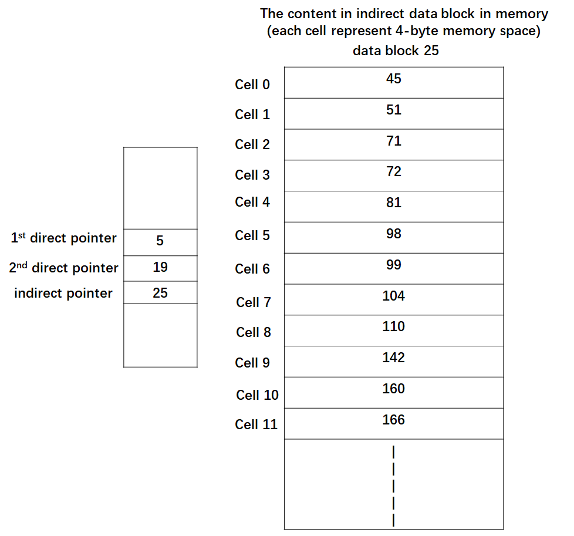
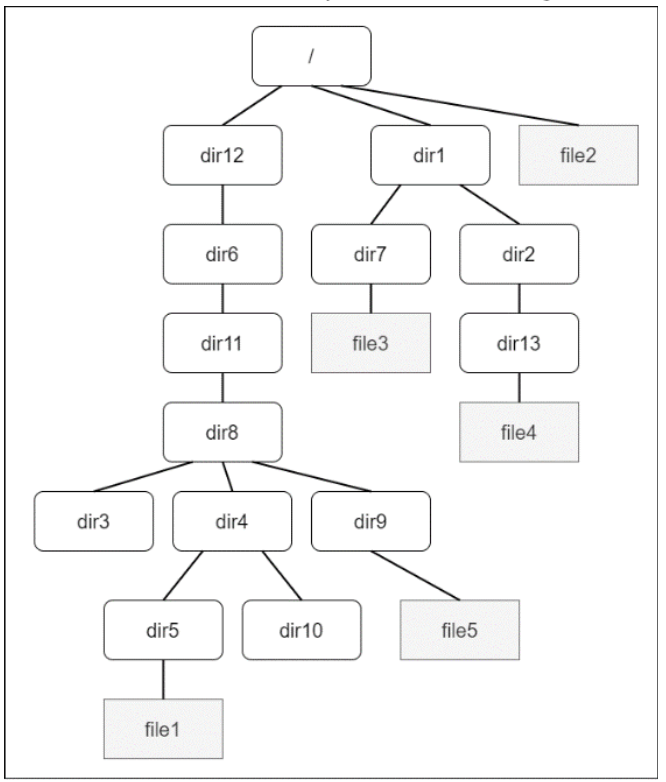
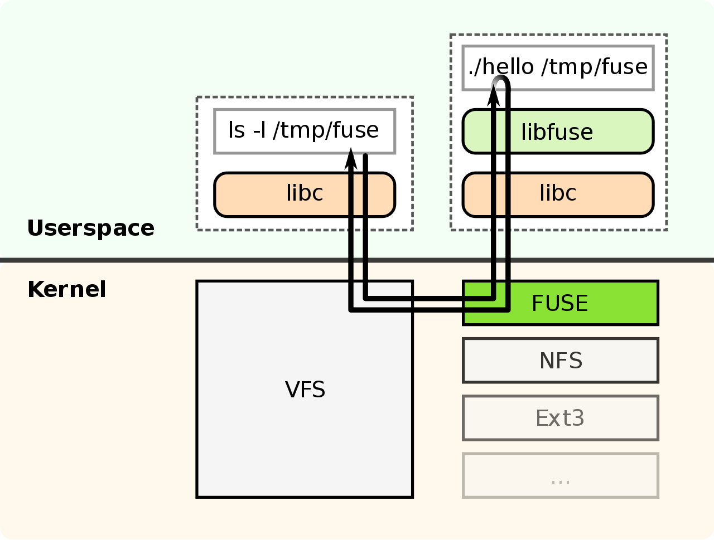
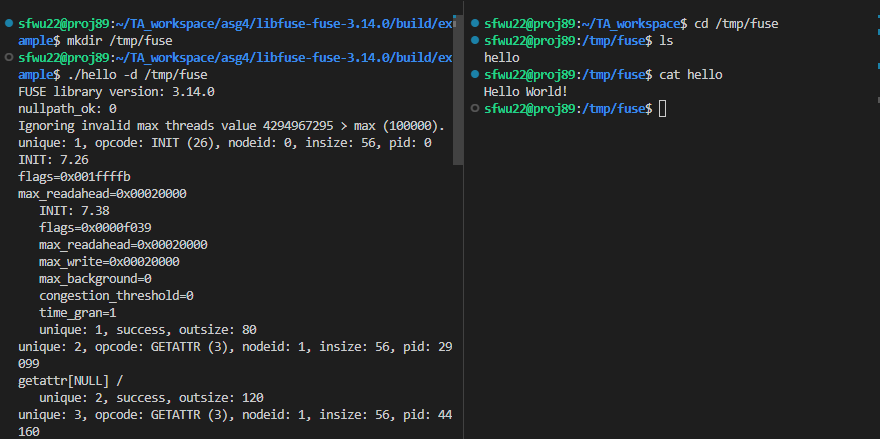
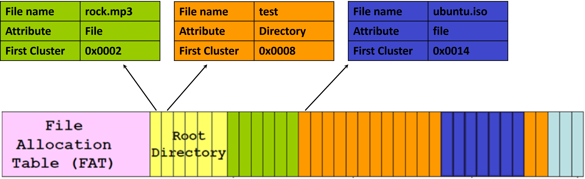
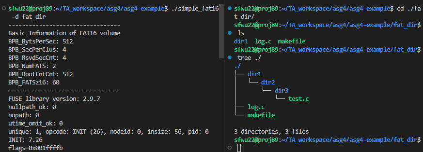

# CSCI 3150 Introduction to Operating Systems:

# Assignment Four

## 1. Assignment Information

- **Deadline: 18:00:00 p.m., Mon, April 17th**

- **Total Marks: 100**

- **Topics: File System**

- **Assignment directory structure**
  
  - assignment-four-student
    - mandatory
      - README.md
    - bonus 
      - README.md
    - README_figs
    - README.md

## 2. **Mandatory Part (100 marks, 2 problems)**

1. Question One (50 marks)
   
   Suppose that there is a file with SFS and we have read the contents of its inode and related data blocks into the memory as shown in the following figure. The size of one data block is 4KB.
   
   
   
   Here, each cell represents a 4-byte memory space and the decimal number inside is the unsigned integer stored correspondingly.
   
   **Answer the following questions:**
   
   (a)	What is the biggest size we can have for a file with SFS? (10 marks)
   
   (b)	Provide data block numbers in sequence that will be read from the disk (only data blocks that contain file data) when *read_t (inum, offset, buff, count)* is called in a user program, where *inum* is the corresponding inode number for the above inode, and *buff* is a pointer that points to a user-defined buffer. *offset* and *count* are the starting point and total bytes to be read in the file. (They are measured by byte)

   For example,  *read_t (inum, 133, buff, 40)*  would read the contents in the file with 40 bytes, from the offset of 133 bytes. (40 marks)
   
   |     | read_t (inum, offset, buff, count) | The data block numbers in sequence that will be read from (**only list the data blocks that contain file data**) |
   | :----- | :---- | :---- |
   | Example1 | read_t (inum, 133, buff, 40); | 5 |
   | Example2 | read_t (inum, 133, buff, 6000); | 5,19 |
   | (i) | read_t (inum, 7000, buff, 10000); | |
   | (ii) | read_t (inum, 12000, buff, 26000); | |
   | (iii) | read_t (inum, 10000, buff, 36000); | |
   | (iv) | read_t (inum, 1000, buff, 31000); | |
   
2. Question Two (50 marks)
   
   In SFS, there exist the files with the hierarchy shown in the figure below.
   
   
   
   Here, “/” is the root directory; “dir1”, “dir2”, “dir3”, “dir4”, “dir5”, “dir6”, “dir7”, “dir8”,
   “dir9”, “dir10”, “dir11”, “dir12” and “dir13” are directory file; “file1”, “file2”, “file3”,
   “file4”, “file5” are regular file.  
   
   
   Suppose we have known that the inode numbers of “/”, “dir1”, “dir2”, “dir3”, “dir4”, “dir5”, “dir6”, “dir7”, “dir8”, “dir9”, “dir10”, “dir11”, “dir12”, “dir13”, “file1”, “file2”, “file3”, “file4” and “file5” are 0, 1, 2, 3, 4, 5, 6, 7, 8, 9, 10, 11, 12, 13, 14, 15, 16, 17 and 18, respectively.
   
   
   
   Moreover, each directory file only occupies one data block (4 KB for one data block), and the data block numbers allocated to “/”, “dir1”, “dir2”, “dir3”, “dir4”, “dir5”, “dir6”, “dir7”, “dir8”, “dir9”, “dir10”, “dir11”, “dir12” and “dir13” are 0, 1, 2, 3, 4, 5, 6, 7, 8, 9, 10, 11, 12, 13 respectively.
   
   
   
   **Answer the following questions:**
   
   (a). Suppose that each directory entry in a directory file is defined by the following structure:
   
   ```c
   typedef struct directory_mapping {
         char file_name[20]; /* The file name of the file */
         int inode_number; /* The inode number of the file*/ 
   }DIR_NODE;
   ```
   
   Each directory file should at least contain two mapping items, “.” and “..”, for itself and its parent directory, respectively (the parent of the root directory is itself). **Give the contents of data blocks 0, 1, 5, 8 and 10, respectively**. (30 marks)
   
   
   
   ( *For each data block, use the following format to list one map*:
   
   **`file_name inode_number `** 
   
   *For example, if “dir12” and “12” are stored in a data block (as the file name and
   inode correspondingly), then show them as follows:*
   
   **`dir12 12  `**
   
   *Note that the mappings for “.” and “..” needs to be displayed as well in a data block.*)
   
   
   
   (b) Suppose a user provides the following absolute path:
   
   **`/dir1/dir2/dir13/file4`**
   
       Show the sequence of the inode numbers and data block numbers we need to pass in order to **obtain the inode number of file4** (starting from the root directory). (20 marks)
   
   

## 3. Bonus Part **(20 marks, 1 problem)**

In the bonus part of assignment four, you will be guided to implement a read-only FAT16 file system based on Filesystem in UserSpace(FUSE). 

### 3.1. Environment Setup

#### 3.1.1. What is FUSE? - An Overview

- FUSE (Filesystem in Userspace) is an interface for userspace programs to export a filesystem to the Linux kernel. The FUSE project consists of three components: 
  - The *fuse* kernel module (maintained in the regular kernel repositories) 
  - The *libfuse* userspace library (maintained in [libfuse github repo](https://github.com/libfuse/libfuse)). libfuse provides the reference implementation for communicating with the FUSE kernel module. 
  - The *fusermount* mount utility. 

Users can write definitions for some operations in FUSE to build their own filesystem. Goto **3.1.3. What is FUSE? - An Example** after Installation to get more insights on how FUSE works.

#### 3.1.2. Installing FUSE

As mentioned in 3.1.1, FUSE has three parts. We now install each part of FUSE to set up our environment.

After linux kernel version 2.6.14, FUSE kernel module is added into the kernel. And usually fusermount utility is also included in the kernel. You can check this by 

```terminal
fusermount --version
# We use version 2.9.7
```

In order to compile our program, we also need libfuse userspace library. Install the library by

```terminal
sudo apt-get install libfuse-dev
```

Then our environment is successfully configured. 

However, if you keep failing the compilation step in 3.3.3, which means libfuse may not be correctly installed. You can go to [libfuse github repo](https://github.com/libfuse/libfuse) to download the source code, then build and install the libfuse library manually. For those who are impatient, quick steps are:

```terminal
# download source
git clone https://github.com/libfuse/libfuse.git
# enter the source directory 
cd libfuse-fuse-[version number]
# create a build directory 
mkdir build; cd build
meson setup ..
# build and install 
meson configure
ninja
sudo ninja install
# test fusermount
fusermount --version
```

These steps will install libfuse library. It will also install fusermount utility (for 2.x version) or fusermount3 utility (for 3.x version). 

For other trouble shooting problems, such as meson version too old, you can find answers online. 

#### 3.1.3. What is FUSE? - An Example after Installation

After installation, let's have a closer look at how FUSE works. The below flow shows how FUSE works: Request from userspace to list files (ls -l /tmp/fuse) gets redirected by the Kernel through VFS to FUSE. FUSE then executes the registered handler program (./hello) and passes it the request (ls -l /tmp/fuse). The handler program returns a response back to FUSE which is then redirected to the userspace program that originally made the request. In this process, each part of fuse does the following tasks:

- The fuse kernel module: It communicates with VFS. And it provides a device named "/dev/fuse" that can be opened by user-space processes.
- The libfuse library: Communicates with kernel-space modules. It receives requests from /dev/fuse and turns these requests into a series of function calls. Then it writes the result back to /dev/fuse. It also provides functions to mount/unmount fuse filesystem.
- fusermount utility: Not used here. But it can also been used for mount/unmount fuse filesystem.

​    

The `hello` program in the figure is actually an official example provided in libfuse github repo. The source code is in /libfuse/example and the executable can be obtained in /libfuse/build/example if you manually build libfuse. Use the following command to test this filesystem example:

```terminal
./hello -d /tmp/fuse
# mount filesystem to /tmp/fuse or whichever directory you want to mount the example filesystem
```

Then go to /tmp/fuse in another terminal, try any command you want. As you can see in the below figure, the filesystem realized by `hello` executable example is successfully mounted to /tmp/fuse, and the filesystem only has one file named "hello" inside of it. 



After testing, unmount the filesystem in another terminal. The command can also be used to unmount the filesystem when you have bugs in your filesystem.   

```terminal
fusermount -u /tmp/fuse   
```

### 3.2. Demystifying FAT

**FAT (File Allocation Table)** is a series of file systems. For personal computers, FAT is the default filesystem for MS-DOS and Windows 9x operating systems. In FAT filesystem, **cluster** is the unit of allocation of disk space, and FAT also refers to the mechanism used in FAT filesystem to record the metadata of clusters. FAT16 use **16-bit** to represent the configuration of clusters. Therefore, the maximum number of clusters supported by a FAT16 is 2<sup>16</sup> = 65536. However, the size of each sector varies with the size of disk partitions. Due to compatibility considerations, the size of a cluster in FAT16 usually does not exceed 32K, which means the size of a FAT16 partition does not exceed 2GB. 

#### 3.2.1. Glossary

- Sector: The unit of a hard disk. 
- Cluster: The unit of allocation in FAT filesystem. A cluster usually have multiple sectors. A cluster can only be occupied by one file.
- Directory: the content of a directory file.
- Directory Entry: the logical unit in a directory file. A directory file has one or multiple directory entries. A directory entry is the metadata of a file and could point to a file or a directory file.

#### 3.2.2. FAT Filesystem Structure

<table>     
<tr>         
    <td><b>Region</b></td>         
    <td colspan="3">Reserved</td>     
    <td colspan="2">FAT Region</td> 
    <td>Root Directory Region</td>
    <td>Data Region</td>     
<tr>
<tr>         
    <td><b>Content</b></td>     
    <td>Boot Sector</td>     
    <td>FS Information Sector(FAT32 only)</td> 
    <td>More reserved sectors (optional)</td>   
    <td>FAT#1</td> 
    <td>FAT#2</td>
    <td>Root Directory (FAT12 and FAT16 only)</td>
    <td>Data (files and directories)</td>
<tr>
<tr>
    <td><b>Size (sectors)</b></td> 
    <td colspan="3"># of reserved sectors</td>
    <td colspan="2">(# of FATs) * (sectors per FAT)</td> 
    <td>(# of root entries * 32) / (bytes per sector)</td>
    <td>(# of clusters) * (sectors per cluster)</td>
<tr>
</table>

A FAT filesystem has the following parts.

- Reserved sectors: Boot sector includes an area called the BPB which contains some basic file system information, in particular its type and pointers to the location of the other sections, and usually contains the operating system's boot loader code. Refer to 3.2.3 for more information.
- FAT Region: FAT16 has two copies of FAT for redundancy. FAT indicates the status of clusters. Refer to 3.2.4 for more information.
- Root Directory Region: Store the information of files and directories of root directory. For FAT16, it lies right after reserved region. 
- Data Region: Store the actual contents of files and directories. Note that a cluster can only be occupied by one file.

#### 3.2.3. Boot Sector

Here lists the detailed content of a boot sector in FAT filesystem. Based on the information in boot sector, we can actually calculate the starting offset (in bytes) of FATs and root directory. 

- The offset of FAT#1 is `BPB_RsvdSecCnt * BPB_BytsPerSec`
- The offset of root directory is `(BPB_RsvdSecCnt * BPB_BytsPerSec) + (BPB_NumFATS * BPB_FATSz16 * BPB_BytsPerSec)` 

| Name               | Offset (byte) | Size (byte) | Comment                                                                      |
| ------------------ | ------------- | ----------- | ---------------------------------------------------------------------------- |
| BS_jmpBoot         | 0x00          | 3           | Jump instruction to jump to boot program                                     |
| BS_OEMName         | 0x03          | 8           |                                                                              |
| **BPB_BytsPerSec** | 0x0b          | 2           | Bytes per sector. Bios parameter block(BPB) starts here.                     |
| **BPB_SecPerClus** | 0x0d          | 1           | Sector per cluster                                                           |
| **BPB_RsvdSecCnt** | 0x0e          | 2           | Number of reserved sectors(including MBR)                                    |
| **BPB_NumFATS**    | 0x10          | 1           | Number of FATs. In FAT16, we have two FATs, so the value here is 0x02        |
| **BPB_RootEntCnt** | 0x11          | 2           | Maximum number of root directory entries                                     |
| BPB_TotSec16       | 0x13          | 2           | Total number of sectors. If the value is zero, use the value at offset 0x20. |
| BPB_Media          | 0x15          | 1           | Media description.                                                           |
| **BPB_FATSz16**    | 0x16          | 2           | Number of sectors in each FAT                                                |
| BPB_SecPerTrk      | 0x18          | 2           | Sector per track                                                             |
| BPB_NumHeads       | 0x1a          | 2           | Number of magnetic heads                                                     |
| BPB_HiddSec        | 0x1c          | 4           | Number of hidden sectors                                                     |
| BPB_TotSec32       | 0x20          | 4           | Total number of sectors. Should be zero if offset 0x13has non-zero value     |
| BS_DrvNum          | 0x24          | 1           |                                                                              |
| BS_Reserved1       | 0x25          | 1           |                                                                              |
| BS_BootSig         | 0x26          | 1           |                                                                              |
| BS_VollID          | 0x27          | 4           |                                                                              |
| BS_VollLab         | 0x2B          | 11          |                                                                              |
| BS_FilSysType      | 0x36          | 8           | Type of filesystem                                                           |
| Reserved2          | 0x3E          | 448         | Boot program                                                                 |
| Signature_word     | 0x01FE        | 2           | End of boot sector                                                           |

#### 3.2.4. File Allocation Table

FAT contains the metadata for clusters in the filesystem. 

- In FAT16, the size of a FAT entry is 16 bit (2 bytes).  

- Each FAT entry has an entry number, starting from FAT entry #0. The first two entries (entry 0 and 1) in the FAT are reserved for special purposes. Entry 0 is reserved to store media type, and entry 1 is reserved to indicate dirty status of the file system.  

- The value of each FAT entry indicates the status of the cluster. The meaning of the value is listed in the table below.

| Value of the Cluster | Meaning                                                                  |
| -------------------- | ------------------------------------------------------------------------ |
| 0x0000               | Free cluster                                                             |
| 0x0001               | Reserved cluster                                                         |
| 0x0002 - 0xFFEF      | Occupied cluster. The value refers to the cluster number of next cluster |
| 0xFFF0 - 0xFFF6      | Reserved values                                                          |
| 0xFFF7               | Bad cluster                                                              |
| 0xFFF8 - 0xFFFF      | The last cluster of a file                                               |

- Every cluster in data region will be mapped uniquely mapped to an entry in FAT table. Since entry 0 and 1 have been reserved for special purposes, the first cluster in data region is numbered **2**. 
- File in the file system takes up at least one cluster and each cluster can only be occupied by one file. The clusters of a file may not be continuous in the data region, and the file system remembers the relationship of clusters with FAT. If a FAT entry has value 0x0002 - 0xFFEF, this value refers to the next cluster in the same file. In this way, the clusters of a file can be traversed by iteratively accessing FAT entry values, starting from the first cluster entry of this file. Refer to 3.2.5 for more information on how files are stored in FAT filesystem.

#### 3.2.5. How is File Stored in FAT?

A file has two related parts in the filesystem: its directory entry and actual file contents. The directory entry of the file will record the file name, extension name, attribute and other metadata. The actual contents of the file are stored in cluster(s) in the data region, while clusters metadata are managed by FAT. If the file is a normal file (attribute in the directory entry is 0x20), these clusters store the file contents. If the file is a directory file (attribute in the directory entry is 0x10), these clusters also store the file contents, but the contents are some directory entries (refer to 3.2.6 for more details).

As we can see in the below figure, we showed three files under root directory, these files all have an entry in the root directory, while their actual contents are stored in data region. Note that clusters of file `ubuntu.iso` is not continuous. The first segment ends at block 18, and block 18 points to block 26, which is how the FAT filesystem remembers all the clusters of a file.  


#### 3.2.6. How is Directory Stored in FAT?

Directory is also a kind of file in FAT. Different from the normal "file", its contents are some directory entries. In FAT16, the length of a directory entry is 32 bytes, and each domain of the entry is shown below.     

| Name             | Offset (byte) | Size (byte) | Comment                                                                        |
| ---------------- | ------------- | ----------- | ------------------------------------------------------------------------------ |
| DIR_Name         | 0x00          | 11          | File name. The first 8 bytes are file name, the last three are extension name. |
| DIR_Attr         | 0x0B          | 1           | File attribute. 0x10 means directory, 0x20 means file                          |
| DIR_NTRes        | 0x0C          | 1           | reserved                                                                       |
| DIR_CrtTimeTenth | 0x0D          | 1           | reserved                                                                       |
| DIR_CrtTime      | 0x0E          | 2           | reserved                                                                       |
| DIR_CrtDate      | 0x10          | 2           | reserved                                                                       |
| DIR_LstAccDate   | 0x12          | 2           | reserved                                                                       |
| DIR_FstClusHI    | 0x14          | 2           | reserved                                                                       |
| DIR_WrtTime      | 0x16          | 2           | Most recent modified time of the file                                          |
| DIR_WrtDate      | 0x18          | 2           | Most recent modified date of the file                                          |
| DIR_FstClusLO    | 0x1A          | 2           | The number of first cluster of a file                                          |
| DIR_FileSize     | 0x1C          | 4           | The size of the file                                                           |

We use a similar example as 3.2.5 to show you how directories are stored in FAT. In the filesystem shown below, we have directory structure:

- \ (root directory)
  - rock.mp3
  - test
    - ubuntu.iso

Under root directory, we have a file `rock.mp3` and a directory file `test`. They have their own directory entry in the root directory.

Since directory `test` is a sub-directory, it is stored in the data region. The content of `test` is a series of directory entries.

The file `ubuntu.iso` is under the sub-directory `test`. So it has a directory entry in `test`. And its contents are stored in the data region just as other normal files.    



### 3.3. Implementing FAT Filesystem Based on FUSE

#### 3.3.1. Starter Code

We provide starter codes to help you finish the bonus part. Download compressed archive of starter code, Makefile and image file. 

```terminal
wget https://www.dropbox.com/s/kn3tldzatkh2r3g/asg4-bonus.zip
unzip ./asg4-bonus.zip
```

#### 3.3.2. TODOs

As we mentioned in 3.1.1, users can write their implementations of several required operations of FUSE. By providing the definitions of these operations to FUSE, your filesystem will understand how it should deal with a disk image file. 

For example, in our start code, we have already implemented `fat16_init`, `fat16_destroy` and `fat16_getattr`. These functions should be passed to `fuse_main` to apply you own version of operation definitions (shown below). 

```c
int main(int argc, char *argv[])
{

    struct fuse_operations fat16_oper = {
        .init = fat16_init,
        .destroy = fat16_destroy,
        .getattr = fat16_getattr,
        .readdir = fat16_readdir,
        .read = fat16_read
        };

    /* some codes here */

    ret = fuse_main(argc, argv, &fat16_oper, fat16_ins);
    return ret;
}
```

Some functions are left unfinished and you are required to finish them. These functions are:

- `path_split`: split the input path by token “/” into multiple strings, and transform the strings to FAT file name format.
- `pre_init_fat16`: read the BPB part to obtain related configurations for the filesystem, and initialize the members of fat16_ins.
- `fat_entry_by_cluster`: return the FAT entry of cluster numbered `ClusterN`.
- `find_subdir`: search for the file or directory specified by path starting from a sub-directory
- `fat16_readdir`: travers all the file names under a specific directory, and return them to fuse
- `fat16_read`: read a specific length of data from a specific file, and return the data to fuse

We provide abundant hints in `simple_fat16.c` and you can use them as a reference for your coding. **Notice that `simple_fat16.c` is the only file that you need to modify and submit.** 

**Please do not change the prototype of these functions since we will test them in our grading process. However, if you do think the framework TA provides has severe problem, please contact TA Shaofeng Wu and discuss with him about the problem you find in detail. We only allow specific student(s) to bypass the code framework, which means we will use other approaches to grade his/her program, when the student do provide strong enough clue and reason for bypassing the starter framework.**

#### 3.3.3. Compile, Run and Verify Your Filesystem

Compile the program

```terminal
make all
```

Mount fat_16.img under ./fat_dir or other directories

```terminal
./simple_fat16 -d fat_dir
```

Then you can open another terminal, to check if the image has been successfully mounted. The output of `ls` and `tree ./ ` should look as follows:



Your filesystem should be able to correctly read files and directories, which means commands related to reading such as `ls`, `cat`, `tree`, etc. should work normally and return correct result in the mounted directory (as the figure shows).

The filesystem we consider in the bonus part is read-only, which means we do not require you to implement functionalities such as creating/deleting file/directories. 

## 4. Submissions

- **Plagiarism, incorrect file name, and lack of comments** **will result in various degrees of deductions in points.**

- The mandatory part is required to be completed for you. For the bonus part, you would get extra scores if you do it.

- In problem1, you need to submit a pdf file named "question1.pdf".

- In problem2, you need to submit a pdf file named "question2.pdf".

- In Bonus part, you only need to submit your revised-version of "'simple_fat16.c" under repo directory /assignment-four-student/bonus/. We encourage you to finish as much coding as possible in the bonus part. Therefore, we have breakdown test cases for each function that needs to be finished by you. The more you code, the more bonus you receive.  

- **Assignment directory structure for submission**
  
  - assignment-four-student (repo root directory)
    - mandatory
      - question1.pdf
      - question2.pdf
    - bonus 
      - simple_fat16.c
  
- Bonus part will be graded in the environment shown below:
  
  - FUSE library version: 2.9.7
  - gcc version: 7.5.0
  - ubuntu version: 18.04
  - Linux version: 4.15.0
  
  Make sure your source code is compatible with this environment. Failure in compilation will result in zero mark. 

- Three TAs are responsible for this assignment together. Questions about the assignment via Piazza are welcomed and preferred. You could also contact TAs via email below. Requests like writing codes and debugging for you will be rejected according to the regulations.

- Contact

| TA          | Assignment Problem | Email                  |
| ----------- | ------------------ | ---------------------- |
| Qin Luo     | Mandatory 1        | qluo22@cse.cuhk.edu.hk |
| Xin Tan     | Mandatory 2        | xtan22@cse.cuhk.edu.hk |
| Shaofeng Wu | Bonus              | wsf123@link.cuhk.edu.hk |
